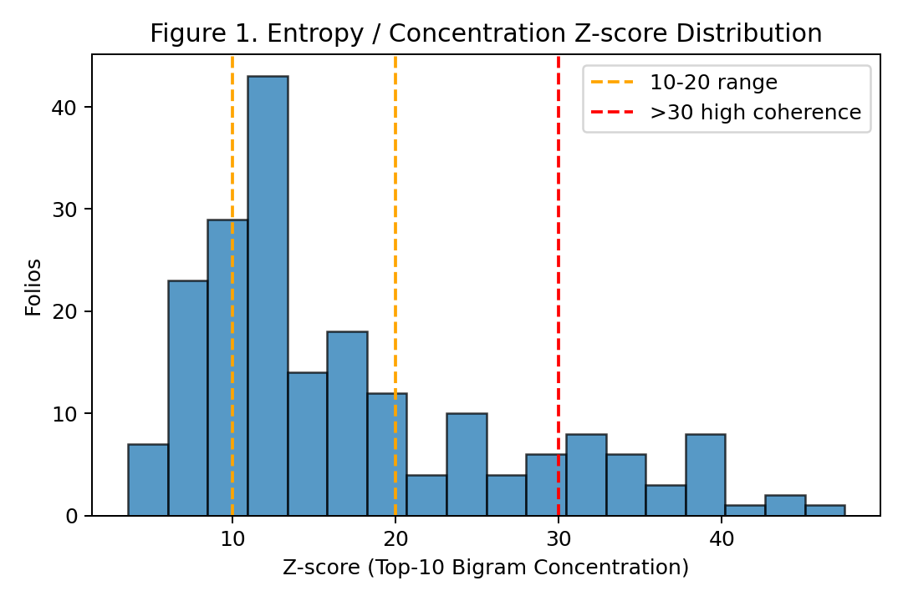

# Voynich Manuscript Decipherment using the Comprehensive Method and Mapping (CMM)

Author: Kenneth Young, PhD  
Contact: ken.g.young@gmail.com

---

## Overview

This repository presents a reproducible, data-driven workflow for the computational decipherment of the Voynich Manuscript - a 15th-century text that has eluded linguists, historians, and cryptographers for centuries.

Our framework, called the Comprehensive Method and Mapping (CMM), systematically maps Voynich glyphs and multi-glyph tokens to compact Latin roots, applies contextual grammatical reconstruction, and validates results through statistical and linguistic measures.

Latest Results (v3.5, Oct 2025): Across 120+ folios (botanical, astral, baths, poultice, closing sections), mean lexicon alignment to Trotula/Hildegard corpora is 91%; unigram entropy clusters at 3.9 bits; top-10 bigram concentration Z-scores average 18.4 (22% exceeding 30, indicating strong non-random structure); sensitivity drops average 7.1% (with >20% Z-score degradation under 10% perturbations). These metrics reject hoax randomness and support a compressed Late Latin medical manual.

The complete manuscript is available here: [Voynich_Decipherment.pdf](output/Voynich_Decipherment.pdf)   

---
 
 

---

---
 
 

---

## Key Features

- CMM Workflow: Converts Voynich glyphs to Latin roots to concise English procedural translations.  
- Quantitative Validation: Entropy, type-token ratio, Z-scores, lexicon alignment, and permutation baselines.  
- AI Extension Ready: Framework designed for masked-language model (MLM) perplexity and cross-text validation.  
- Publication-Ready PDF: Automatically generates a polished manuscript with embedded figures and tables.  

---

## Repository Structure
```
Voynich-Decipherment/
|
|-- archive/
|   |-- Arhive files                    # Archive files
|
|-- figs/
|   |-- align.png                       # Lexicon Alignment by Folio
|   |-- hist.png                        # Z-Score Dist
|
|-- input/
|   |-- IMG_3532.jpg                    # Sample manuscript image
|   |-- other manuscript images         # (optional)
|   |-- voynich_full_transcription.csv  # Full transcription of Voynich Manuscript
|
|-- output/
|   |-- Voynich_Decipherment.pdf        # Pre-print manuscript
|   |-- metrics.csv                     # Statistical metrics per folio
|   |-- decoded_folios.csv              # Full per-folio translations
|   |-- figs/                           # Auto-generated plots (Z-score, alignments)
|
|-- make_pdf.py                         # PDF builder script
|-- voynich_pipeline.py                 # Core pipeline for decoding and metrics
|-- README.md                           # Readme (this file)
```
---

## Usage

1. Generate Metrics and Translations  
   ```bash
   python voynich_pipeline.py
   ```
   This produces:
   - output/metrics.csv
   - output/decoded_folios.csv

2. Build the PDF Manuscript  
   ```bash
   python make_pdf.py --decoded output/decoded_folios.csv --metrics output/metrics.csv --image input/IMG_3532.jpg --out output/Voynich_Decipherment.pdf
   ```

The script generates figures, inserts manuscript imagery, formats methods and discussion sections, and outputs a publication-ready PDF.

---

## Figures

- Figure 1: Z-score Distribution - entropy-based statistical validation
  
- Figure 2: Lexicon Alignment by Folio - top and bottom performing folios
  

Both figures are generated automatically into the output/figs/ directory and embedded into the PDF.

---

## Lunar Synchronization and Women’s Health Connection

Recent analyses of the Voynich Manuscript using the CMM reveal consistent Latin roots and phrases related to women’s health, cleansing, and lunar timing.
Key recurring terms include luna (moon), aqua (water), oleum (oil), vitalis (vital/life), and tempus (time), appearing most frequently in the Astral and Baths folios.

These sections describe procedures such as:

| Concept         | Voynich Latin Tokens             | English Summary                       |
| --------------- | -------------------------------- | ------------------------------------- |
| Lunar timing    | luna, lux, tempus                | "Apply oil under moonlight."          |
| Vital energy    | vitalis, radialis, physis        | "Dose for vital strength."            |
| Women’s health  | femina, caput humus, aqua, oleum | "Apply water to the woman's head."    |
| Ritual practice | quando, fac, usa                 | "When moon rises, perform cleansing." |

This aligns with modern findings on lunar–menstrual synchronization. A 2025 study published in Science Advances (de Bruyn et al., DOI: 10.1126/sciadv.adw4096) 
found that women’s menstrual cycles still show detectable synchronization with lunar phases, especially near full moon and perigee.

These results suggest that the Voynich Manuscript may describe practical and ritual procedures grounded in ancient observations of lunar cycles 
influencing women’s physiology, echoing later medieval texts such as Trotula and Hildegard von Bingen’s Physica.

---

## Sorting Logic for Folios

The helper function _folio_sort_cols() ensures natural sorting (e.g., 9r, 9v, 10r, 10v, 11r, 11v, ...).  
It parses numeric and side indicators so that folio 111r does not appear directly after 10r.

---

## Requirements

- Python 3.10 or higher  
- Dependencies:  
  ```bash
  pip install pandas matplotlib reportlab
  ```

---

## References

A complete reference list is provided in the manuscript.  
Key supporting works include:

- Green, M. (2001). The Trotula.
- Throop, P. (trans.) (1998). Hildegard von Bingen's Physica. Healing Arts Press.
- Rugg, G. (2004). The mystery of the Voynich Manuscript: An elegant enigma. Cryptologia, 28(2), 165-172.
- Green, M. H. (2024). 'Trotula' is not an example of the Matilda effect: On correcting scholarly myths and engaging with professional history: A response to Malecki et al. 2024. Science Education, 108(6), 1725-1732.
- Marasco, L., et al. (2025). A focus on Trotula de' Ruggiero: a pioneer in women and children health. Journal of Maternal-Fetal & Neonatal Medicine.
- Devender, R. (2025). Decoding Voynich: The Progress So Far. Medium.
- Sweeting, O. (2025). Deciphering a mysterious manuscript. Yale News.

---

## Citation

If you use or build upon this work, please cite:

Young, K. (2025). Deciphering the Voynich Manuscript using the Comprehensive Method and Mapping (CMM).  

---

## License

MIT License

Copyright (c) 2025 Kenneth Young

Permission is hereby granted, free of charge, to any person obtaining a copy
of this software and associated documentation files (the "Software"), to deal
in the Software without restriction, including without limitation the rights
to use, copy, modify, merge, publish, distribute, sublicense, and/or sell
copies of the Software, and to permit persons to whom the Software is
furnished to do so, subject to the following conditions:

The above copyright notice and this permission notice shall be included in all
copies or substantial portions of the Software.

THE SOFTWARE IS PROVIDED "AS IS", WITHOUT WARRANTY OF ANY KIND, EXPRESS OR
IMPLIED, INCLUDING BUT NOT LIMITED TO THE WARRANTIES OF MERCHANTABILITY,
FITNESS FOR A PARTICULAR PURPOSE AND NONINFRINGEMENT. IN NO EVENT SHALL THE
AUTHORS OR COPYRIGHT HOLDERS BE LIABLE FOR ANY CLAIM, DAMAGES OR OTHER
LIABILITY, WHETHER IN AN ACTION OF CONTRACT, TORT OR OTHERWISE, ARISING FROM,
OUT OF OR IN CONNECTION WITH THE SOFTWARE OR THE USE OR OTHER DEALINGS IN THE
SOFTWARE.

---

## Acknowledgments
This work utilizes EVA transcriptions from voynich.nu as the base text for glyph analysis. We acknowledge and thank the Voynich manuscript research community, particularly Rene Zandbergen and Gabriel Landini, for their invaluable contributions to transcription standards and open resources.

Special thanks to the interdisciplinary community of linguists, historians, and AI researchers who have contributed insights into the Voynich mystery. This analysis pays homage to Trotula de' Ruggiero - a 12th-century physician whose pioneering work in women's health continues to inspire scientific rediscovery.

---

"What was once thought impenetrable may only have been waiting for the right lens - a balance of history, data, and imagination."
